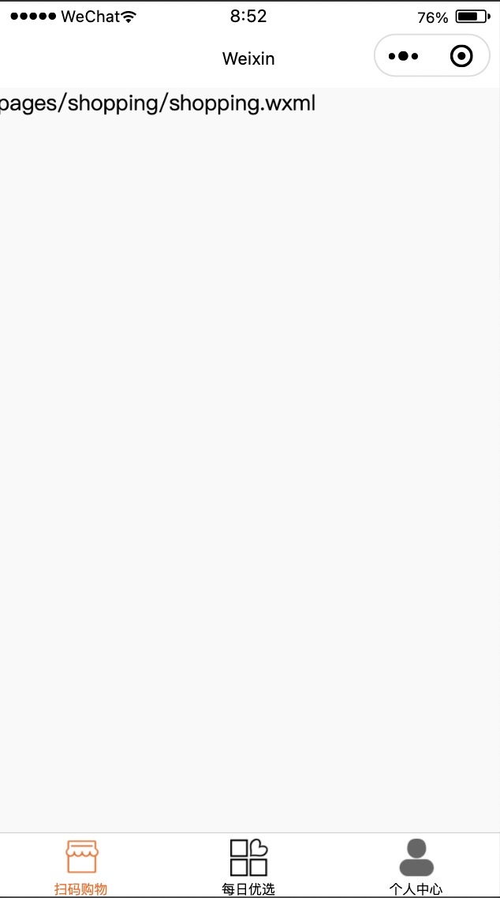
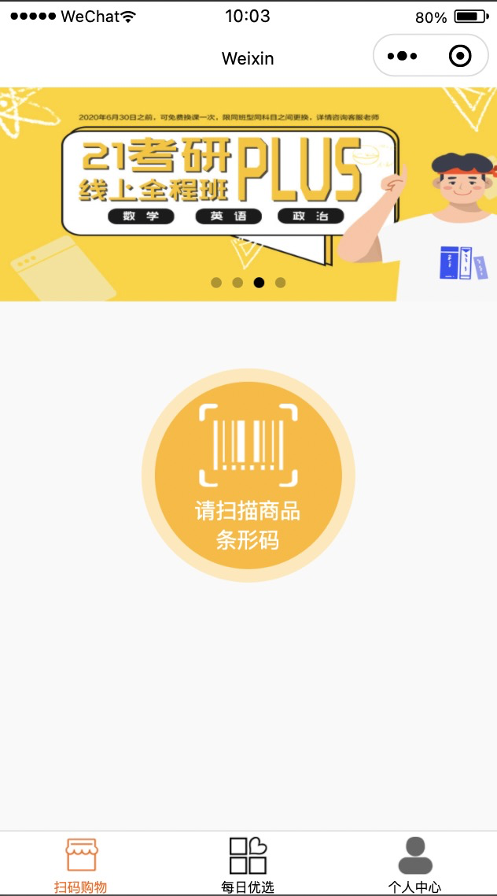

# 扫码购小程序

[toc]

## 一、创建项目并进行版本控制

1. 创建本地仓库
2. 创建远程仓库
3. 在本地仓库创建项目
4. 将创建的项目添加到暂存区
5. 将暂存区的项目添加到本地仓库
6. 将本地仓库和远程仓库建立连接
7. 将本地仓库的代码推送远程仓库

## 二、创建项目目录结构

| 目录       | 描述                                        |
| ---------- | ------------------------------------------- |
| assets     | 存放静态资源.比如: 图片、样式文件、字体文件 |
| config     | 存在配置文件                                |
| model      | 存放模型文件, 比如 api封装                  |
| pages      | 存放页面                                    |
| components | 存放组件                                    |
| utils      | 存放工具类方法文件                          |
| app.js     | 小程序全局入口文件                          |
| app.json   | 小程序全局配置文件                          |


## 三、封装http请求以及封装API

1. 创建config.js文件, 配置请求的公共接口地址

   ```javascript
   const config = {
     baseURL : 'https://admin.hxwendeng.com/api/app'
   }
   export {config}
   ```

2. 在utils文件夹内创建request.js文件,封装wx.requestfang方法

   ```javascript
   import {config} from "../config/config"
   
   const tips = {
     1 : "发生未知错误", 
     10005 : "未输入用户名和密码",
     10006 : "用户未登录",
     10007 : "token不能为空"
   }
   
   
   class Http{
     request({url, method = "GET", data = {}}){
       return new Promise((resolve,reject)=>{
         this._request({url, resolve, reject, method, data})
       })
     }
   
     _request({url,resolve, reject, method = "GET", data = {}}){
       wx.request({
         url: config.baseURL + url,
         method,
         data,
         success : (response)=>{
   
           const code = response.statusCode.toString()
   
           if(code.startsWith("2")){
             resolve(response.data)
           }
   
           reject()
         
           const error_code = response.data.error_code
           this._show_error(error_code)
         },
         fail(error){
           reject(error)
           this._show_error(1)
         }
       })
     }
   
     _show_error(error_code){
       if(!error_code){
         error_code = 1
       }
   
       const tip = tips[error_code]
       
       wx.showToast({
         title: tip ? tip : tips[1],
         icon : "none",
         duration : 2000
       })
     }
   }
   
   
   export default Http
   ```

3. 在model文件夹内创建index.js文件,封装api接口

   ```javascript
   import Http from "../utils/request"
   
   class IndexModel extends Http{
     getNav(){
       return this.request({url : "/nav", method : "GET"})
     }
     
     getBanner(){
       return this.request({url : "/banner", method : "GET"})
     }
   
     getCourse(){
       return this.request({url : "/recommend/appIndex", method : "GET"})
     }
   }
   
   
   
   export default IndexModel
   ```

4. 在页面调用api接口, 以下为调用示例

   ```javascript
   // index.js
   import IndexModel from "../../model/index"
   const indexModel = new IndexModel()
   Page({
   
     /**
      * 页面的初始数据
      */
     data: {
       
     },
   
     /**
      * 生命周期函数--监听页面加载
      */
     onLoad: function (options) {
       this.handleGetNav()
       this.handleGetBanner()
       this.handleGetCourse()
     },
   
   
     async handleGetNav(){
       const res = await indexModel.getNav()
       console.log(res)
     },
   
     async handleGetBanner(){
       const res = await indexModel.getBanner()
       console.log(res)
     },
   
     async handleGetCourse(){
       const res = await indexModel.getCourse()
       console.log(res)
     }
   })
   
   ```

## 四、封装一些公共方法


## 五、创建TabBar以及TabBar对应的页面



**tabBar**

```json
{
    "pages": [
        "pages/shopping/shopping",
        "pages/product/product",
        "pages/personal/personal"
    ],
    "window": {
        "backgroundTextStyle": "light",
        "navigationBarBackgroundColor": "#fff",
        "navigationBarTitleText": "Weixin",
        "navigationBarTextStyle": "black"
    },
    "tabBar": {
        "selectedColor": "#f60",
        "backgroundColor": "#fff",
        "list": [
            {
                "pagePath": "pages/shopping/shopping",
                "text": "扫码购物",
                "iconPath": "/assets/images/index02.png",
                "selectedIconPath": "/assets/images/index01.png"
            },
            {
                "pagePath": "pages/product/product",
                "text": "每日优选",
                "iconPath": "/assets/images/product02.png",
                "selectedIconPath": "/assets/images/product01.png"
            },
            {
                "pagePath": "pages/personal/personal",
                "text": "个人中心",
                "iconPath": "/assets/images/user02.png",
                "selectedIconPath": "/assets/images/user01.png"
            }
        ]
    },
    "style": "v2",
    "sitemapLocation": "sitemap.json"
}
```


## 六、扫码购物页面开发

### 6.1 实现页面布局



`Shopping.wxml`

```html
<view class="shopping">
  <t-swiper swiperList="{{swiperList}}"></t-swiper>
  <view class="scancode">
    <view class="button">
      <image src="../../assets/images/qrcode.png"></image>
      <text>请扫描商品条形码</text>
    </view>  
  </view>
</view>

```

`Shopping.wxss`

```css
/* pages/shopping/shopping.wxss */
.shopping{
  height : 100%;
  display: flex;
  flex-direction: column;
}
.scancode{
  flex : 1;
  display: flex;
  justify-content: center;
  padding-top:100rpx;
  box-sizing: border-box;
}
.button{
  width: 280rpx;
  height: 280rpx;
  border-radius: 50%;
  background-color: #FEB81C;
  border : 10px solid #FFE8B6;
  display: flex;
  align-items: center;
  justify-content: center;
  flex-direction: column;
}
.button image{
  width: 168rpx;
  height: 143rpx;
}
.button text{
  display: block;
  width: 163rpx;
  color : #fff;
  text-align: center;
  margin-top: 5rpx;
}
```

`Shopping.js`

```javascript
// pages/shopping/shopping.js
import IndexModel from "../../model/index"
const indexModel = new IndexModel()
Page({

  async getBanner(){
    const response = await indexModel.getBanner()
    console.log(response)
    this.setData({
      swiperList : response.data
    })
  },

  /**
   * 页面的初始数据
   */
  data: {
    swiperList : []
  },

  /**
   * 生命周期函数--监听页面加载
   */
  onLoad: async function (options) {
    this.getBanner()
  }
})
```

`Shopping.json`

```json
{
  "usingComponents": {
    "t-swiper" : "/components/swiper/swiper"
  }
}
```

`swiper.wxml`

```html
<view class="swipper">
    <swiper indicator-dots autoplay circular>
      <swiper-item wx:for="{{swiperList}}" wx:key="index">
        <image  src="{{item.banner_img}}"></image>
      </swiper-item>
    </swiper>
  </view>
```

`swiper.wxss`

```css
/* components/swiper/swiper.wxss */
.swipper, swiper, image{
  width: 100%;
  height : 320rpx;
}
```


### 6.2 点击扫码调用扫码相机

**实现思路:**

1. 给按钮绑定点击事件
2. 调用扫码相机
3. 扫描商品
4. 获取条形码

### 6.3 扫码成功之后获取到商品条形码

### 6.4 调用商品信息接口,查询到商品信息

### 6.5 将商品信息保存到本地

### 6.6 跳转到购物车页面


## 七、购物车页面开发

### 7.1 实现购物车静态页面布局

### 7.2 获取本地存储的商品数据

### 7.3 渲染获取到商品数据

### 7.4 购物车价格计算(加、减、总价)

### 7.5 商品的删除

### 7.6 商品的继续添加功能

### 7.6 去结算功能

## 八、订单页面开发


### 8.8 支付功能

1. 打开小程序先进行登录
2. 获取登录之后的用户信息 --- openid
3. 将用户信息保存到本地
4. 在订单页点击支付按钮,触发一个方法
5. 在这个方法里面 调用统一下单接口
6. 接口调用成功之后,后台会返回支付所要的参数
7. 获取到支付所需要的参数之后
8. 通过wx.requestPayment发起支付
9. 支付成功的处理
10. 支付失败的处理

## 九、支付成功页面开发


## 十、个人中心页面


## 十一、账户余额页面开发


## 十二、余额明细页面开发


## 十三、项目总结